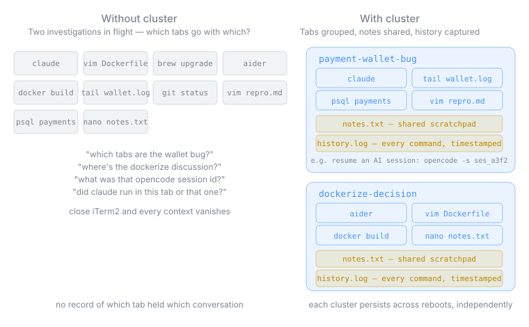

# What is a cluster?

You start a conversation not knowing where it will lead. An idea pops into your head — maybe it'll become a repo, maybe a `brew install`, maybe nothing — and you want to engage with it before it slips away. A cluster is where that engagement lives: a named workspace for terminal tabs and AI sessions that belong to the same thread of thinking, even when that thread doesn't yet belong to a project on disk.

A cluster gives you three things at once: **topical containment** (shell terminals or tabs that belong together stay together, named), **shared notes** (`notes.txt`, openable from any tab in the cluster with `notes`), and **command history** (`history.log`, every command in any tab, timestamped). All three survive closing iTerm2 and rebooting. That's what makes the history file useful for more than just memory: an AI session ID logged there can be resumed days later with `opencode -s ses_a3f2` or its equivalent.

Each cluster lives in `~/.clusters/<timestamp>[-<name>]/` (the name is an optional slug you pass to `cluster-init`). The tabs run inside a tmux session of the same name, which is what gives them persistence — but you don't need to know anything about tmux to use a cluster. The ten `cluster-*` commands plus `nn` and `notes` are the full surface area.

See [README.md](README.md) for the walkthrough, and [INSTALL.md](INSTALL.md) for setup.
